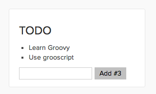
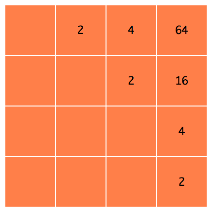
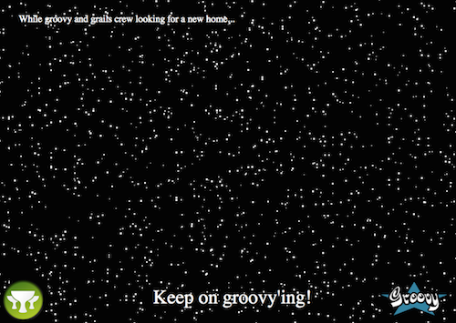

Grooscript demos
================

### Groovy code converted to javascript with [grooscript](http://grooscript.org)

## Using Node.js with colors, request and async npm's [guide](http://grooscript.org/nodejs_example.html)

[Dsl](https://github.com/chiquitinxx/grooscript-demos/tree/master/src/main/groovy/Execute.groovy)

## Jackson Pollock painting demo, see in [action](http://grooscript.org/demo/bezier.html)

[Draw](https://github.com/chiquitinxx/grooscript-demos/tree/master/src/main/groovy/paint/Draw.groovy)
[Functions](https://github.com/chiquitinxx/grooscript-demos/tree/master/src/main/groovy/paint/Functions.groovy)

## Creating components like [react.js](http://facebook.github.io/react/) but in Groovy [guide](http://grooscript.org/react_example.html)

[Sources](https://github.com/chiquitinxx/grooscript-demos/tree/master/src/main/groovy/react)
[In action](http://grooscript.org/demo/react.html)

## Live conversions from [asciidoctor](http://asciidoctor.org/) to html

[Source](https://github.com/chiquitinxx/grooscript-demos/blob/master/src/main/groovy/asciidoctor/AdocLive.groovy)

### [Try it!](http://grooscript.org/demo/asciidoctor.html)

## 2048 game, [play!](http://grooscript.org/demo/game.html)

[Sources](https://github.com/chiquitinxx/grooscript-demos/tree/master/src/main/groovy/game)

## Interactive graphic search, see in [action](http://grooscript.org/demo/sigma.html)

[Source](https://github.com/chiquitinxx/grooscript-demos/blob/master/src/main/groovy/countries)

## Basic chat running in Node.js, deployed in Heroku [join](https://cryptic-headland-6974.herokuapp.com/) [+info](http://grooscript.org/chat_example.html)

[Server](https://github.com/chiquitinxx/grooscript-demos/blob/master/src/main/groovy/startServer.groovy)
[Client](https://github.com/chiquitinxx/grooscript-demos/blob/master/src/main/groovy/chat/Client.groovy)

## Svg clock, see in [action](http://grooscript.org/demo/snapsvg.html)

## See all stars moving [here](http://grooscript.org/demo/stars.html)

## Three.js objects [here](http://grooscript.org/demo/three.html)

[Source code](https://github.com/chiquitinxx/grooscript-demos/blob/master/src/main/groovy/three)

## Create a Rest API fake using npm faker and json-server

[Source code](https://github.com/chiquitinxx/grooscript-demos/blob/master/src/main/groovy/authors.groovy)

Build
---

In build.gradle, there are all the task to convert groovy files to javascript. Convert all demos with **./gradlew convertAll** :)

To get links and info to run demos run **./gradlew showInfo**

To run the demos in Node.js (colors.js, startChat.js and restApi), you need Node.js installed, and run **npm install** (maybe as sudo) to install dependencies.