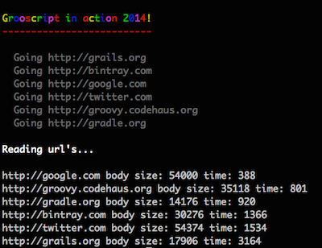

= Using http://grooscript.org[grooscript] Node.js support
:author: Jorge Franco
:email: grooscript@gmail.com
:source-highlighter: pygments
:icons: font

With grooscript, you can convert your groovy code to javascript. Main use is associated to web applications
running in your browsers, in the client side. But maybe, you want to use in the server side, in a
http://nodejs.org[Node.js] application. I think node isn't the best idea in your server side, but has very
good things, as a very big community and lot of modules. Also, that application runs very fast.

The source code of this example is in https://github.com/chiquitinxx/colors[github]. You need node.js, and some
http://www.npmjs.org/[npm] modules. Only grooscript module is needed to use grooscript converted code, rest
of modules are used for fun in this example. Install node.js, then install modules:

[source,bash]
--
> npm install grooscript
> npm install colors
> npm install request
> npm install async
--

Also you need https://github.com/chiquitinxx/grooscript-gradle-plugin[grooscript gradle plugin] to convert groovy
code to javascript. Install http://www.gradle.org[gradle] if you don't have it installed in your machine. You can use
http://gvmtool.net[Gvm] to install gradle 2.0.

=== Gradle

Is a node.js project, but we will use gradle to work with groovy files and convert to javascript.

[source,groovy]
--
include::build.gradle[]
--
<1> Get grooscript gradle plugin from bintray.
<2> Use it.
<3> As a normal groovy proyect we will use groovy and some grooscript features.
<4> Groovy file to be converted to javascript.
<5> Folder to save js file.
<6> Put in destination js files all dependencies needed.
<7> Classpath to use when compiling groovy file before convert it.

To convert +Execute.groovy+ to javascript, do +> ./gradlew convert+. There are more task, to explore the
plugin take a look at link:starting_gradle.html[starting guide].

=== Node.js

Now, let's take a look to +colors.js+ code. The Node.js application that you run with node:

[source,javascript]
--
include::colors.js[]
--
<1> Grooscript module, needed if you use groovy converted code in your application.
<2> The javascript converted file with the code of our application.

=== Groovy

Grooscript support a lot of groovy magic, as traits, dsl's, lists, ... This application play a bit with
some Node.js modules using a bit of that magic. You are creating your application in groovy, and you can
use the tools you know, as Spock, Codenarc, Gradle,... always better than use javascript :)

[source,groovy]
--
include::src/main/groovy/Execute.groovy[]
--
<1> Color output in your console using colors.js module.
<2> Add node.js modules.
<3> Execute tasks in parallel using async.js module.

[source,groovy]
--
include::src/main/groovy/nodejs/NodeJs.groovy[]
--
<1> Out groovy class implements a trait.
<2> This AST will put in your js method the code between /* and */
<3> Add colors module in constructor, because color functions comes with the trait.
<4> Request comes from request module.
<5> Use async module to make a parallel execution of groovy closures that will be javascript functions at runtime.
<6> You use groovy features in your code as @DelegateTo, to get help from your IDE writing the DSL.

Finally the trait with the functions to color our console info +JsColors.groovy+:

[source,groovy]
--
include::src/main/groovy/colors/JsColors.groovy[]
--

All this groovy code is converted to javascript and will run in your Node.js application.

=== Run it

If your groovy code is converted to javascript, a file +js/Execute.js+ must exist. To convert +Execute.groovy+
use +> ./gradlew convert+. If some error, as compilation error, or conversion failure, you get info in the console.
If all is ok, just run the application with +> node colors.js+

This application use some nice Node.js modules, as show console messages in console, get content from url's,
or launch tasks concurrently.

=== Conclusion

This is not the best example, but you can take the idea, how to interact between Node.js and groovy. Groovy
can do the same things that node, but maybe you have to use javascript(sorry) and you can introduce Groovy magic
to make your javascript life more fun.

Please, if you have comments, suggestions, problems,... don't hesitate to contact me at grooscript@gmail.com, or open
an issue or feature in http://github.com/chiquitinxx/grooscript/issues?state=open[Github]. This is an open source project and your feedback is more than welcome
to improve it. More guides come in the future, also can find more documentation in http://grooscript.org[grooscript]
site.